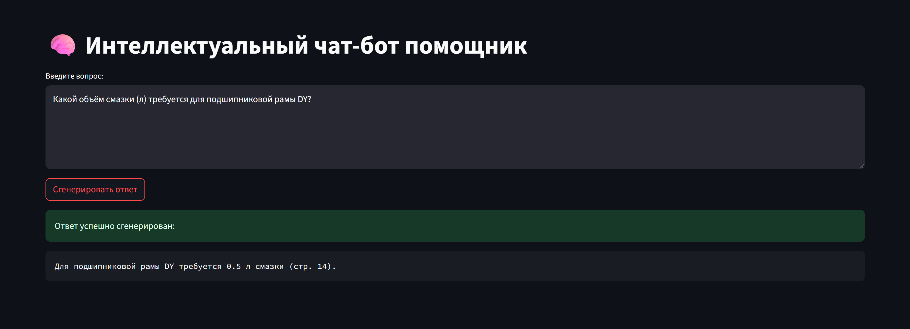

# 🗪 Интеллектуальный чат-бот помощник

## ℹ️ Информация о проекте

Сервис для ответов на вопросы пользователей по [руководству](https://docs.yandex.ru/docs/view?url=ya-disk-public%3A%2F%2FvP9DuuSIlMqd6GVrgSSECelmO3zjz9Gb2NdvcODb0N6PEOJFjQOhEXisZa3B%2FD7Pq%2FJ6bpmRyOJonT3VoXnDag%3D%3D&name=Руководство%20по%20насосам%20шламовым%204%20DY%20-AHF.pdf&nosw=1). Для реализации проекта использовалась техника RAG.

## 📱 UI

## ⚙️ Сервисы

- **backend 🗄️**

  - API для маршрутизации запросов
  - Логика RAG, реализованная с помощью `langchain`
- **frontend 🖼️**

  - Streamlit UI, подключается к `http://backend:8000`

## 🛠️ Работа с сервисом

Информация, необходимая для работы с сервисом:

1. Так как обработка исходных данных частично производилась в ручном режиме, полная автоматизация обработки данных, деления текста на чанки и их сохранение в `Qdrant` были невозможны. Более подробно с этой частью работ можно ознакомиться в `notebooks/rag_research.ipynb`.
2. По причине, описанной в предыдущем пункте, в качестве векторного хранилища использовалось облако `Qdrant`. Для получения доступа к необходимой коллекции можно обратиться к автору проекта в Telegram - @Khrstln.
3. Для доступа к моделям OpenAI использовался сервис ProxyAPI.

## 🚀 Запуск сервиса

После получения доступа к коллекции Qdrant у автора проекта для успешного запуска сервиса необходимо выполнить следующие шаги:

1. `git clone https://github.com/khrstln/RAG-system.git`
2. Перейти в корень проекта и создать файл `.env`, в который необходимо внести следующие переменные:

   * PROXYAPI_KEY - Ваш API-ключ, полученный с помощью сервиса ProxyAPI
   * PROXYAPI_BASE_URL="https://api.proxyapi.ru/openai/v1"
   * QDRANT_API_KEY - API-ключ облака `Qdrant`, полученный у автора проекта (Telegram - @Khrstln)
   * QDRANT_URL - URL коллекции `Qdrant`, полученный у автора проекта (Telegram - @Khrstln)
   * BACKEND_URL="http://backend:8000"
3. В cmd запустить команду: `docker-compose up --build`
4. UI сервиса будет доступен по адресу `http://localhost:8501/`

## 🏆Результаты

* Использование сторонних инструментов для распознавания таблиц позволило значительно повысить качество исходных текстовых данных, полученных с помощью `pdf2image` и `pytesseract`.
* Использование продвинутых техник RAG, таких как HyDE и Multi-Query, а также LLM `gpt-4o-mini` удалось достичь высокой точности ответов на вопросы из контрольного списка несмотря на низкое качество исходных данных. С ответами на контрольные вопросы можно ознакомиться в jupyter-ноутбуке `notebooks/rag_research.ipynb`.
* В качестве метрики для разработанной системы использовался `BERTScore F1`. Референсные ответы были получены с помощью модели `gpt-o3`, которой на вход подавался исходный pdf-файл. Финальные значения `BERTScore F1` находятся в районе ~0.83. Вероятно, весьма невысокие значения метрики обусловлены тем, что `gpt-o3` давала ответы на вопросы, "видя" весь исходный файл целиком, а также наличием продвинутой OCR, что позволяло анализировать изображения и схемы.

## 📈 Развитие проекта

В качестве основных направлений для улучшения ответов RAG можно выделить следующие:

- **Обработка данных**: Для использования системы в продакшне необходимо усовершенствовать и автоматизировать пайплайн обработки данных. Для повышения качества можно использовать для обработки данных более узкоспециализированные модели для работы распознавания таблиц, провеести эксперименты с другими моделями распознавания текста для повышения качества распознавания структуры
- **Мультимодальность**: В подобных документах значительная доля информации может содержаться на схемах и других изображениях. Использование моделей для векторизации изображений и добавление их эмбеддингов в векторное хранилище расширит возможности системы и повысит качество ответов.
- **Продвинутые техники RAG**: Использование таких техник, как SelfQuery, FLARE, реранжирования с помощью CrossEncoder'а и др. Практика показывает, что перечисленные подходы позволяют значительно улучшить качество ответов LLM в продакшне.
